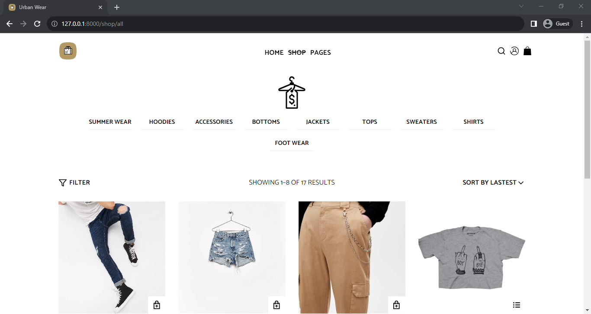

# urbanWear

## Overview

This is a full-stack e-commerce application built using Django and React. It allows users to browse and purchase products, manage their shopping cart, checkout using Stripe, create accounts, manage orders, apply coupons, and more.

[Visit the Website](https://urbanwear.onrender.com)

## Features

- **Product Catalog:**
  - View a list of products with details.
  - Filter products by size, category, and price range.

- **Shopping Cart:**
  - Add products to the cart.
  - Specify quantities and select sizes if required.
  - Edit cart items, including quantity and size.
  - Remove items from the cart.

- **User Accounts:**
  - Create an account during checkout.
  - Log in with existing accounts.
  - Change passwords for logged-in users.
  - Manage billing and shipping addresses.

- **Checkout:**
  - Securely checkout and pay with Stripe.
  - Choose different billing and shipping addresses or use the same for both.

- **Order History:**
  - View order history for logged-in users.
  
- **Coupons:**
  - Apply coupons to orders and get discounts.

- **Guest Cart:**
  - Users can add items to the cart without creating an account.

## Installation

1. Clone the repository: `git clone https://github.com/IgweDaniel/urbanWear.git`
2. Navigate to the project directory: `cd <cloned-folder-name>`
3. Install Python dependencies using Poetry: `poetry install`
4. Install Node.js dependencies for the React frontend: `cd client && npm install`

## Configuration

### Django

1. Set up your Django settings:
   - Create a `.env` file from the provided `.env.example` and configure your environment variables such as `SECRET_KEY`, `DEBUG`, `DATABASE_URL`, and `STRIPE_SECRET_KEY`.
   - Run Django migrations: `python manage.py migrate`
   
2. Seed the Database (Optional):
   - If you want to populate the database with default products and sizes, run the seed function: `python manage.py seed data.json`

3. Media Storage Configuration:
   - The project supports two media storage options based on the `DEBUG` environment variable:
     - If `DEBUG` is set to `True`, media files are stored locally using file storage.
     - If `DEBUG` is set to `False`, media files are stored on Cloudinary using django-cloudinary-storage.
   
### React

1. Build the React frontend:
   - In the `frontend` directory, run `npm run build`.

2. Start the Django development server: `python manage.py runserver`

3. Access the application in your web browser at `http://localhost:8000`.

## Technologies Used

- Django with Django Rest Framework
- PostgreSQL database
- Redux Toolkit for state management
- Styled Components for styling
- Axios for making HTTP requests
- Formik for form handling
- React-Query for data fetching and synchronization
- Stripe for payment processing

